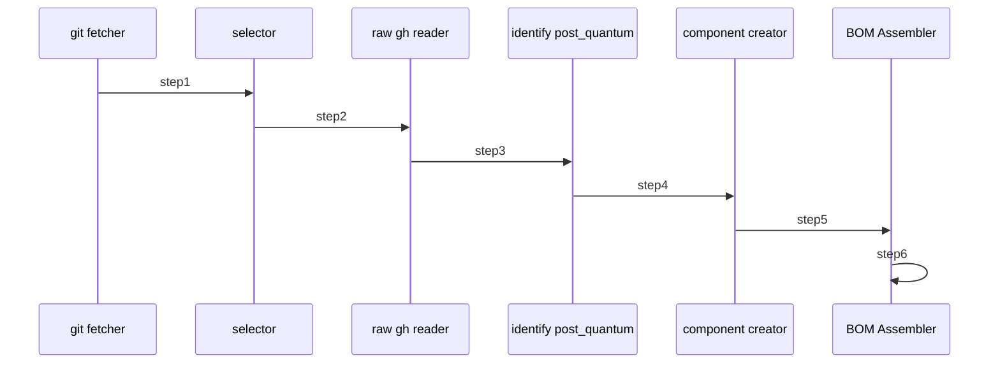

# CBOM.ai — Cryptographic Bill of Materials Demo

This repository contains a Maestro-based proof‑of‑concept that generates a Cryptographic Bill of Materials (CBOM) for a given GitHub Java project. It orchestrates a pipeline of autonomous agents to:

(1) Fetch all .java file URLs from a GitHub repo.

(2) Select a target file at random (or by position).

(3) Read the raw content of that file.

(4) Identify uses of post‑quantum‑vulnerable crypto APIs or functions.

(5) Aggregate findings into CycloneDX‑style component entries.

(6) Assemble a complete CBOM JSON document.

## 📦 Architecture & Agents

### 1. Git Fetcher

Purpose: Recursively list .java files via GitHub’s Trees API.

Output: Python list of raw.githubusercontent.com URLs.

### 2. Selector

Purpose: Choose one URL from the list (first element or random).

Output: Single URL string.

### 3. Raw GH Reader

Purpose: Fetch full file content via HTTP (requests).

Output: Plain Java source text.

### 4. Post‑Quantum Identifier

Purpose: Scan source for non‑quantum‑safe crypto (AES, RSA, Cipher.getInstance, etc.).

Output: JSON array of occurrences with algorithm, line, snippet.

### 5. Component Creator

Purpose: Group occurrences by algorithm into CycloneDX components.

Output: JSON array of component objects with bom-ref, evidence, cryptoProperties.

### 6. BOM Assembler

Purpose: Wrap header, metadata, components, dependencies into a final CBOM.

Output: Complete CycloneDX BOM JSON document.

### Mermaid Diagram

<!-- MERMAID_START -->

<!-- MERMAID_END -->